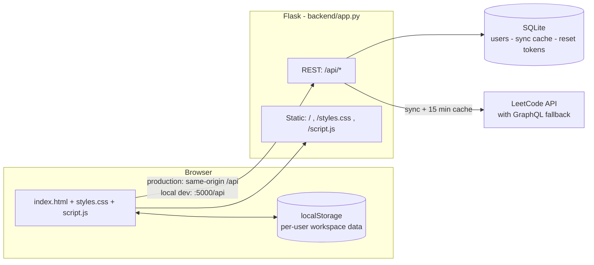

<div align="center">

# CODETRACK

**A coding progress dashboard that turns daily problem-solving into visible momentum.**

Track sessions, sync LeetCode, watch your streaks grow — from one clean, fast workspace.

[](https://www.python.org/)
[](https://flask.palletsprojects.com/)
[](https://www.sqlite.org/)
[](#-tech-stack)
[](DEPLOY.md)

</div>

---

## Table of contents

- [Overview](#-overview)
- [Features](#-features)
- [Tech stack](#-tech-stack)
- [Architecture](#-architecture)
- [Quick start](#-quick-start)
- [Configuration](#-configuration)
- [API reference](#-api-reference)
- [Project structure](#-project-structure)
- [Deployment](#-deployment)
- [Data & privacy](#-data--privacy)
- [Known limitations](#-known-limitations)
- [Contributing](#-contributing)
- [Acknowledgements](#-acknowledgements)

## 📌 Overview

CODETRACK is a personal dashboard for developers and CS students who want an honest picture of
their problem-solving habits. It combines **manually logged coding sessions** with **live LeetCode
data** and presents them as streaks, heatmaps, charts, and goal progress — no spreadsheets, no
build tooling, no framework overhead.

**Highlights**

- **Single-service deployment** — one Flask process serves the REST API *and* the static frontend.
- **Works offline** — guest mode keeps all data in the browser; the backend is optional.
- **Zero build step** — plain HTML, CSS, and JavaScript. Clone, open, ship.
- **Session-based accounts** — Werkzeug password hashing, `HttpOnly` / `SameSite=Lax` cookies,
  CORS origin allowlist, and expiring password-reset tokens.

## ✨ Features

| Area | What you get |
| --- | --- |
| **Dashboard** | Greeting header, problems solved, monthly progress, current & best streak, focus hours with a weekly 5h target, activity heatmap, goal rings, and a recent-sessions feed. |
| **Session logging** | Log a session in seconds: problem name, topic, time spent, difficulty, and language. |
| **Goals** | Create, edit, and delete goals with targets, due dates, and progress rings. Get notified when a goal completes or is due soon. |
| **Problems** | Searchable, filterable, sortable table merging your logged sessions with LeetCode-synced submissions. |
| **Statistics** | Acceptance rate, average solving time, difficulty donut, language usage, submissions-over-time chart, and time-range filters (all time / this week / this month). |
| **Activity** | Date-range summaries (7 days / month / all time), monthly summary, streak calendar with heatmap legend, and a timeline of recent work. |
| **Profile** | Editable bio, skills, and links; profile photo upload; shareable public profile snapshot; GitHub repository stats via the public API. |
| **LeetCode sync** | One-click sync with retry, last-synced timestamp, stale-cache fallback, and per-user server-side caching (15-minute TTL). |
| **Accounts & auth** | Sign up, sign in, guest/offline mode, password reset by email (or link printed to server logs when SMTP is not configured), account email/password changes. |
| **Extras** | Light/dark theme, hash-based SPA routing, toast notifications, notifications dropdown, JSON/CSV backup export and JSON restore, fully responsive layout. |

## 🛠 Tech stack

| Layer | Choice | Why |
| --- | --- | --- |
| Frontend | HTML5, CSS3, vanilla JavaScript | No framework, no bundler — loads instantly and is easy to fork. |
| Typography | DM Mono + Manrope (Google Fonts) | A readable mono/humanist pairing for data-heavy UI. |
| Backend | Flask + Flask-Cors | Small, explicit REST layer in a single file. |
| Database | SQLite | Zero-configuration storage for accounts and sync cache. |
| WSGI | Gunicorn | Production-grade app server used on Render. |
| Hosting | Render | Blueprint-driven deploys straight from GitHub. |

## 🏗 Architecture



In production, the frontend talks to **same-origin `/api`**; during local development
(`localhost` or `file://`) it automatically targets the Flask server on **port 5000** — no
configuration needed either way.

## 🚀 Quick start

### Prerequisites

- Python **3.13** (any 3.10+ should work)
- Git

### 1. Clone and install

```bash
git clone https://github.com/katragaddajaswanth/CodeTrack.git
cd CodeTrack

python -m venv .venv
# Windows
.venv\Scripts\activate
# macOS / Linux
source .venv/bin/activate

pip install -r backend/requirements.txt
```

### 2. Run the backend

```bash
python backend/app.py
```

The API is now live at `http://127.0.0.1:5000` (health check: `/api/health`).

### 3. Run the frontend

Serve the repository root with any static server, for example:

```bash
python -m http.server 5500
```

Then open `http://localhost:5500`. Because the hostname is `localhost`, `script.js` finds the
backend on port `5000` automatically. (VS Code Live Server works too.)

### 4. Or skip the backend entirely

Click **"Continue as guest (Offline mode)"** on the sign-in screen — the full dashboard runs
from `localStorage` alone; accounts and LeetCode sync just won't be available.

## ⚙ Configuration

Environment variables are optional for local development (sensible defaults are built in):

| Variable | Default | Purpose |
| --- | --- | --- |
| `CODETRACK_SECRET_KEY` | auto-generated `backend/.codetrack-secret` | Signs session cookies. Set this in production. |
| `CODETRACK_FRONTEND_URL` | `http://localhost:5500` | Base URL used in password-reset links. |
| `CODETRACK_FRONTEND_ORIGIN` | common localhost ports | Comma-separated CORS allowlist for the frontend. |
| `CODETRACK_LEETCODE_CACHE_TTL` | `900` (seconds) | How long synced LeetCode data is cached per user. |
| `CODETRACK_SMTP_HOST` / `PORT` / `USER` / `PASSWORD` | unset | SMTP credentials for reset emails. If unset, the reset link is printed to the server log instead. |
| `PORT` | `5000` | Server port (Render sets this automatically). |

Copy `backend/.env.example` as a starting point for your own values.

## 🔌 API reference

| Method | Endpoint | Auth | Description |
| --- | --- | --- | --- |
| `POST` | `/api/auth/signup` | — | Create an account and start a session |
| `POST` | `/api/auth/login` | — | Sign in |
| `POST` | `/api/auth/logout` | Session | End the session |
| `GET` | `/api/auth/me` | Session | Current user |
| `PUT` | `/api/auth/account` | Session | Change email and/or password |
| `POST` | `/api/auth/forgot-password` | — | Request a password-reset link |
| `POST` | `/api/auth/reset-password` | — | Reset a password with a valid token |
| `GET` | `/api/leetcode/sync?username=…` | Optional | Live LeetCode profile + recent submissions (cached) |
| `GET` | `/api/health` | — | Service health check |
| `GET` | `/`, `/styles.css`, `/script.js` | — | Static frontend (production) |

All responses are JSON; errors return a human-readable `error` field with an appropriate status code.

## 📂 Project structure

```
CodeTrack/
├── index.html          # App shell: auth screen + five dashboard views
├── script.js           # SPA logic, rendering, API client, state
├── styles.css          # Design system, light/dark themes, responsive layout
├── render.yaml         # Render blueprint (build, start, env, health check)
├── .python-version     # Pins Python 3.13 for Render
├── DEPLOY.md           # Step-by-step deployment guide
└── backend/
    ├── app.py          # Flask app: auth, LeetCode sync, static serving
    ├── requirements.txt
    ├── .env.example
    └── .gitignore      # Keeps the SQLite DB and secret out of Git
```

## 🌍 Deployment

CODETRACK deploys to **Render** as a single web service — the blueprint in
[`render.yaml`](render.yaml) wires up the build command, gunicorn start command, generated
secret key, and the `/api/health` check.

```bash
git push origin main   # Render redeploys automatically
```

Full walkthrough (including GitHub setup and post-deploy env vars): **[DEPLOY.md](DEPLOY.md)**.

## 🔐 Data & privacy

- **Accounts** live in SQLite on the server (email, display name, password hash — never plaintext).
- **Your workspace** (sessions, goals, profile, stats) is stored in the browser's `localStorage`,
  namespaced per user (`codetrack:<user>:<key>`), so multiple people can share a device.
- **Guest mode** never sends workspace data anywhere.
- **LeetCode sync** caches server-side per account for 15 minutes to respect upstream rate limits.
- **Backups**: export everything as JSON or CSV from *Settings*, and restore from JSON at any time.

## ⚠ Known limitations

- On Render's **free plan**, the instance disk is ephemeral: the SQLite database is wiped on
  redeploys/restarts. Use a persistent disk or migrate to Render Postgres for durable accounts.
- Free instances spin down after inactivity — the first request after idle takes ~30 seconds.
- Password-reset emails require SMTP credentials; without them, links are logged to the server console.

## 🤝 Contributing

Contributions are welcome:

1. Fork the repository
2. Create a feature branch (`git checkout -b feature/amazing-thing`)
3. Commit your changes (`git commit -m "Add amazing thing"`)
4. Push and open a Pull Request

Please keep the frontend dependency-free and the backend single-file unless a change truly
demands otherwise.

## 🙏 Acknowledgements

- [Flask](https://flask.palletsprojects.com/) and [Werkzeug](https://werkzeug.palletsprojects.com/)
- [LeetCode community API](https://alfa-leetcode-api.onrender.com) with the official GraphQL endpoint as fallback
- [Google Fonts](https://fonts.google.com/) — DM Mono & Manrope
- [Render](https://render.com/) for hosting

---

<div align="center">

**Built for showing up — one session at a time.**

</div>


| **Dashboard** | Greeting header, problems solved, monthly progress, current & best streak, focus hours with a weekly 5h target, activity heatmap, goal rings, and a recent-sessions feed. |
| **Session logging** | Log a session in seconds: problem name, topic, time spent, difficulty, and language. |
| **Goals** | Create, edit, and delete goals with targets, due dates, and progress rings. Get notified when a goal completes or is due soon. |
| **Problems** | Searchable, filterable, sortable table merging your logged sessions with LeetCode-synced submissions. |
| **Statistics** | Acceptance rate, average solving time, difficulty donut, language usage, submissions-over-time chart, and time-range filters (all time / this week / this month). |
| **Activity** | Date-range summaries (7 days / month / all time), monthly summary, streak calendar with heatmap legend, and a timeline of recent work. |
| **Profile** | Editable bio, skills, and links; profile photo upload; shareable public profile snapshot; GitHub repository stats via the public API. |
| **LeetCode sync** | One-click sync with retry, last-synced timestamp, stale-cache fallback, and per-user server-side caching (15-minute TTL). |
| **Accounts & auth** | Sign up, sign in, guest/offline mode, password reset by email (or link printed to server logs when SMTP is not configured), account email/password changes. |
| **Extras** | Light/dark theme, hash-based SPA routing, toast notifications, notifications dropdown, JSON/CSV backup export and JSON restore, fully responsive layout. |
